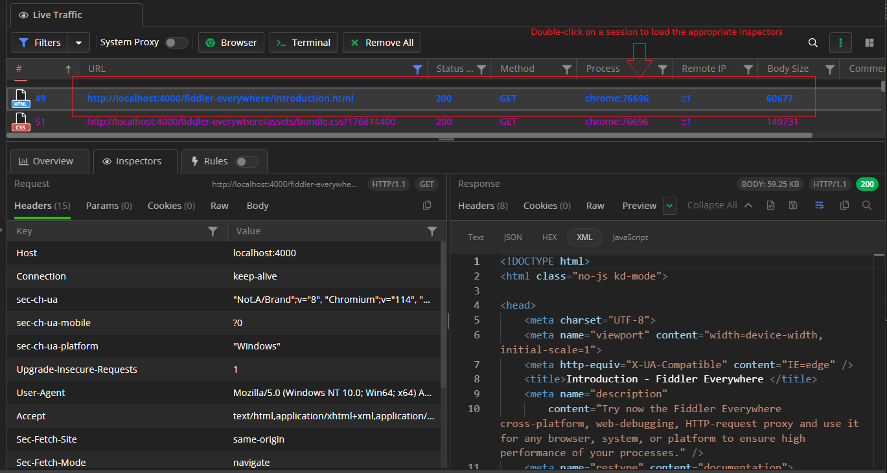
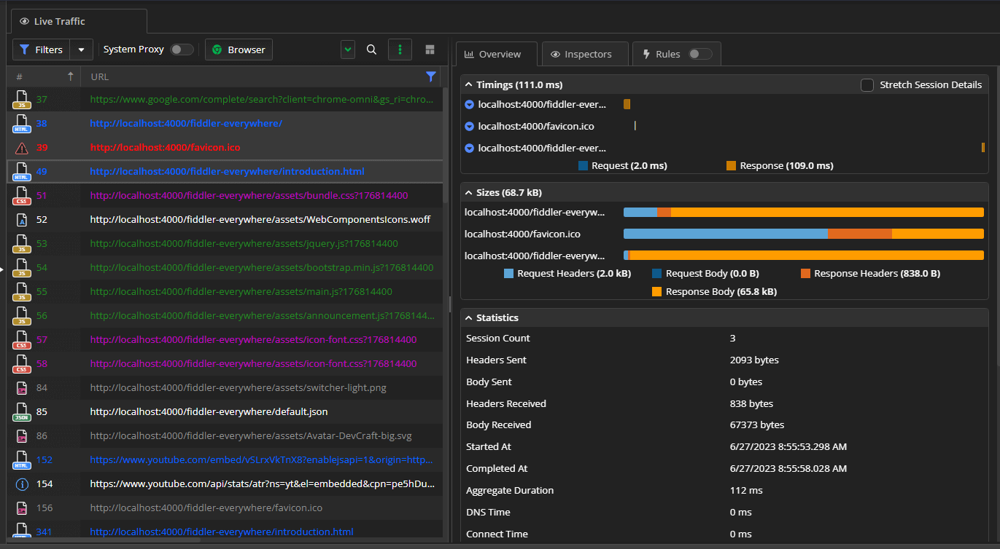

## Inspecting HTTPS Traffic

The core function of Fiddler Everywhere is to capture HTTPS requests and responses and to visualize its content through a cognitive UI. The ongoing HTTP traffic shows in the **Live Traffic grid**, which contains multiple columns.

To inspect the HTTP Request and Response headers and bodies, follow these steps:

1. Capture HTTP(S) traffic while using your preferred [capturing mode]().

1. Double-click on a captured session.

The session content immediately loads in the Fiddler's **Inspectors**. The application automatically decides which inspector is best suited to display the request and response of the double-clicked session. Alternatively, you can use a single click on a session to preserve the last shown inspector.

[Deep-dive into the Fiddler's inspectors tab here ...]()

## Overview Traffic Statistics

To extract information about the captured sessions, go to the **Live Traffic** tab, where each request/response entry (session) shows in a row with multiple columns fields in the **Sessions** list. There you can extract valuable data such as the returned status code, the host and the URL, the type of the used protocol (HTTP or HTTPS), the body sizer in bytes, and the HTTP method (GET or POST). The output traffic can be filtered, exported, commented on, and shared for further and detailed inspection.

To open the structured information about the session in the [**Overview** tab](), follow these steps:

1. Capture HTTP(S) traffic while using your preferred [capturing mode]().

1. Select a session, and switch to the **Overview** tab.

[Deep-dive into the Fiddler's Overview tab here ...]()

## Sessions List

To save a selected session or multiple selected sessions, use the **Live Traffic** grid context menu or use a keyboard shortcut. Saved sessions are available in the [**Sessions list**](), from which they can be reloaded or shared with collaborators.

The inspection of sessions often happens with teammates or external collaborators. Share a selected session or multiple selected sessions directly from the **Live Traffic** grid or by using the [**Sessions** list]().

[Deep-dive into the Fiddler's Sessions list here ...]()