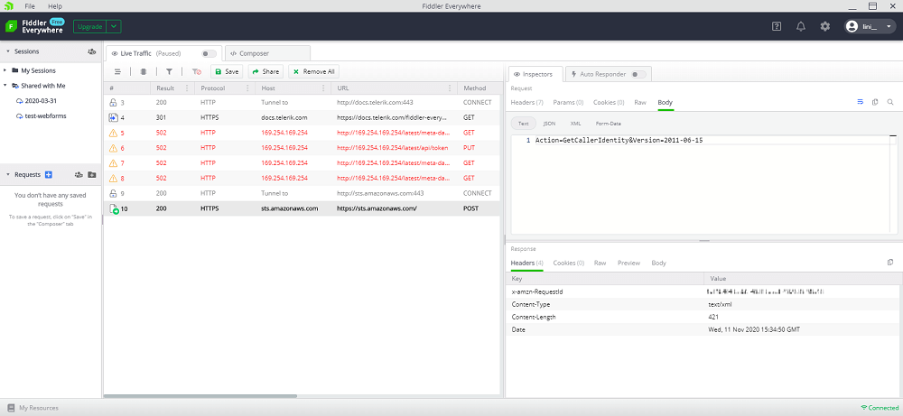

## Environment

|   |   |
|---|---|
| Product   |
| Product Version | 1.0.0 and above  |
| 3rd-party tool | [AWS CLI](https://aws.amazon.com/cli/) |
| Supported OS | macOS, Linux, Windows |

## Description

Amazon Web Services (AWS) is a popular tool that provides multiple options for configuring and managing computing power, database storage, content delivery, and others through the [AWS CLI](https://aws.amazon.com/cli/). How can I set up Fiddler Everywhere to track requests made from the AWS CLI?

## Solution

* [Configuring the AWS CLI alongside Fiddler Everywhere](#configuring-the-aws-cli-alongside-fiddler-everywhere)
* [Resetting the AWS CLI to default settings](#resetting-the-aws-cli-to-default-settings)

### Configuring the AWS CLI alongside Fiddler Everywhere

To capture traffic generated from AWS CLI commands, you need to configure the Fiddler Proxy for the preferred terminal application (where AWS CLI will be executed) and configure the `AWS_CA_BUNDLE` environment variable for the certificate bundle that will be used for HTTPS certificate validation.

1. Open the terminal application where the AWS CLI commands will run. Set the terminal application to use the Fiddler Everywhere proxy, as described in [this KB article]().

1. Open Fiddler Everywhere and export the `Fiddler_Root_Certificate_Authority.crt` file through **Settings** > **HTTPS** > **Advanced Settings** > **Export root certificate(PEM/ASCII format)** (note that this is **not** the default option from the drop-down menu). The certificate is exported to **~/Desktop** as file with name **Fiddler_Root_Certificate_Authority.pem**.

1. Use the exported PEM file to set the `AWS_CA_BUNDLE` environment variable. The `AWS_CA_BUNDLE` specifies the path to a certificate bundle to use for HTTPS certificate validation. If defined, this environment variable overrides the value for the profile setting `ca_bundle`.
    ```Shell
    export AWS_CA_BUNDLE=~/Desktop/Fiddler_Root_Certificate_Authority.pem
    ```

5. Start capturing the traffic generated from the AWS CLI commands.
    ```Shell
    aws sts get-caller-identity
    ```

    

### Resetting the AWS CLI to Default Settings

After the debugging of the request is over, reset the `AWS_CA_BUNDLE` environment variable by using the `unset` command.

```Shell
unset AWS_CA_BUNDLE
```

You can also [reset the Fiddler Proxy in your terminal application](#reset-fiddler-proxy-(terminal-app)).
