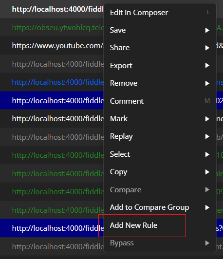

# Modifying Traffic

Fiddler Everywhere provides powerful debugging techniques for testing APIs and mocking server and client behavior. Modifying traffic through the [Rules](#using-rules) tab is a crucial part of the Fiddler testing and debugging capabilities.

## Using Rules

One of the most powerful features in Fiddler Everywhere resides in the **Rules** tab. You can create rules that change HTTP Requests & Responses on-the-fly based on different criteria. The rules can combine multiple criteria and apply single or multiple actions, allowing you to mock real-life scenarios with a few clicks. The various combination of matching conditions and actions that can be combined and applied into single or multiple rules enables you to test client and server applications without changing or accessing their code. 

To modify captured session through the **Rules**:

1. Start any [capturing mode]() with Fiddler Everywhere and initiate the request. As a result, the session is captured and displayed in the **Live Traffic** list.

1. Select the desired session and right-click to open the context menu. From the context menu, select **Add New Rule**.

    

1. The session data is automatically populated in the **Rules Builder**. You can further modify the matching conditions and the desired actions. 

    

1. Click **Save** to preserve the rule.

Fiddler automatically adds the newly created rule on the top of the [**Rules Queue**](#rules-queue), giving it immediate execution priority (you can demote or promote each rule in the queue). The rule is also automatically activated (the rule switch is toggled on), so any new requests that match the rule will be affected by it. You can also replay the original session through its context menu (**Replay > Reissue Requests**).

### Additional Rules Resources

- [Mocking Server Responses]()
- [Explaining final and non-final actions in the Rules tab]()
- [Using predefined actions in the Rules tab]()
- [Redirecting through the Rules tab]()
- [Returning Custom HTTP Responses]()