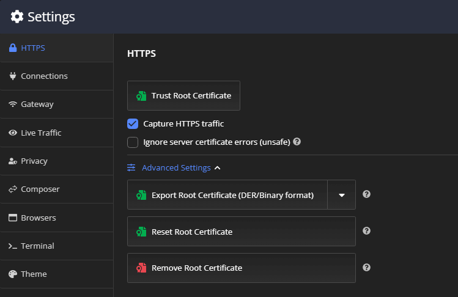

# HTTPS Menu

After the initial startup, Fiddler Everywhere default captures only non-secure traffic (HTTP).

To enable the capturing and decrypting of HTTPS traffic, you need to install the Fiddler root certificate through the **HTTPS** sub-menu under **Settings**.

- **Trust Root Certificate**&mdash;Installs and trusts the Fiddler root certificate. The option is available only on [macOS](#start-system-capturing) and [Windows](#start-system-capturing). On Linux, you have to [export and trust the root certificate manually](#start-system-capturing). After you install the certificate, you are ready to [enable the capturing of HTTPS traffic](#capture-https-traffic).

- **Capture HTTPS traffic**&mdash;Defines if Fiddler Everywhere will capture HTTPS traffic or skip it. By default, this option is disabled. Before you enable the capturing of HTTPS traffic, you must trust the Fiddler root certificate.

- **Ignore server certificate errors**&mdash;Controls whether Fiddler Everywhere warna you if an HTTPS server presents a certificate that cannot be validated. Do not check this box when surfing the Internet because of a possible [spoofing security threat](https://en.wikipedia.org/wiki/Spoofing_attack). 

    * The **Ignore server certificate errors** checkbox is active (with a tick), but the ignore list is left blank&mdash;Fiddler will automatically ignore all server certificate errors. 

    * The **Ignore server certificate errors** checkbox is active (with a tick), and the ignore list is populated with specific endpoints&mdash;Fiddler will ignore only server certificate errors for the listed endpoints. Note that adding endpoints to the ignore list will work only for new connections.

    * The **Ignore server certificate errors** checkbox is inactive (no tick)&mdash;Fiddler won't ignore server certificate errors, and upon hitting one, will present a special Fiddler's page that informs the user about the insecure connection. The custom Fiddler's page also provides a quick link to add the specific endpoint to the ignore list.

- **Advanced Settings**&mdash;A drop-down menu that provides the following additional options related to the Fiddler root certificate:
    - **Export Root Certificate**&mdash;A drop-down menu to select a format and export the Fiddler root certificate to the operating system **Desktop** folder. Some operating systems might not have a default folder named **Desktop**. In such cases, you must create this folder (`~/Desktop` for macOS and Linux distributions) to export the certificate successfully. Fiddler Everywhere provides options to export the following formats:
        * **Export Root Certificate(DER/Binary format)**&mdash;Exports the Fiddler Everywhere trust certificate in binary format as `FiddlerRootCertificate.crt`.
        * **Export Root Certificate(PEM/ASCII format)**&mdash;Exports the Fiddler Everywhere trust certificate in ASCII format as `FiddlerRootCertificate.pem`.
        * **Export Root Certificate(PKCS 12 format)**&mdash;Exports the Fiddler Everywhere trust certificate in PKCS 12 format as `FiddlerRootCertificate.p12`.
    - **Reset Root Certificate**&mdash;Click the button to remove the currently trusted root certificate, generate a new one, and trust it.
    - **Remove Root Certificate**&mdash;Click the button to remove the currently trusted root certificate from the OS certificate store. As a result, the capturing of HTTPS traffic will be disabled.

The following figure displays the default settings of the **HTTPS** menu.  

## Inline Notifications

If the Fiddler root CA is not yet trusted, an inline notification will warn you that the [system HTTPS capture](#system-capturing) is disabled. This notification will hide if you use the [independent browser capturing option](#independent-browser-capturing) and will re-appear once you close the active independent browser instance.

 